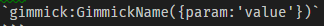
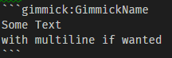
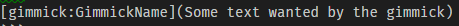
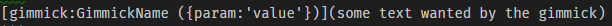

# Gimmick core system

## What is the gimmick system

The gimmick systems let's writers of markdown files to add dynamic or external content to their documents. Gimmicks are written inside single line or multiline fences or like links. [How to use them](#HowToUseThem)

## When it's used and how to use gimmicks in a markdown file

### When

Gimmicks are used in a markdown files and are written as followed in them:

### How

* Single line
    A single line gimmick should be written like that:
    
    or like that:
    
* Multi line
    A multiline gimmick should be written like that:
    

    Note: multiline gimmicks can't have options. If a "multiline" gimmick has options, it will be considered a singleline gimmick by the sytstem.

* Link
    A link gimmick should be written like that:
    
    or like that:
    
    [More infos about link gimmicks](http://dynalon.github.io/mdwiki/#!gimmicks.md)

## How it works (internally)

After the initial transformation of the markdown to html, a parser will check the page to see which gimmicks it will need. At this step, the system will only load needed gimmicks, detected by the parser. The gimmicks will then run their task during their subscribed stage. If an unknown gimmick is detected, it will be replaced by a default one that will display debug information helping to locate it and correct it afterward.